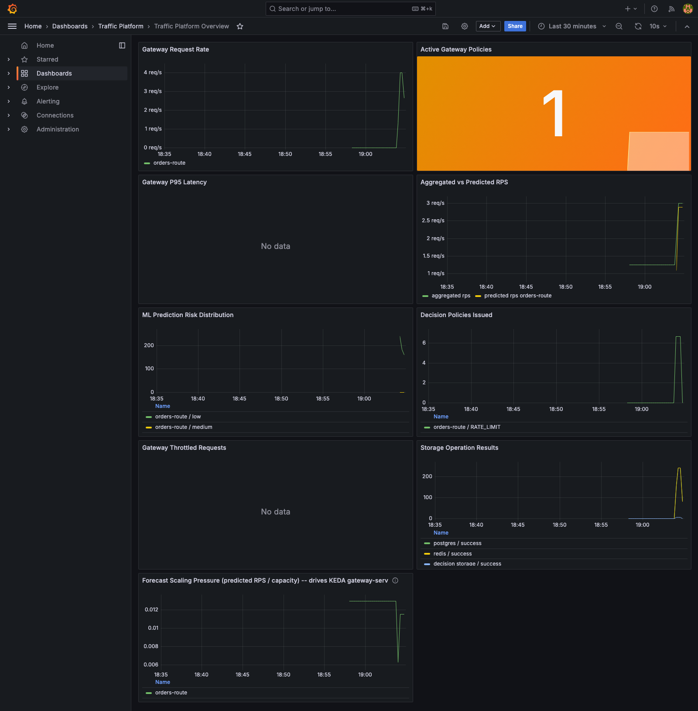

# Intelligent Traffic Management System

[](https://github.com/Yaswanth2120/intelligent-traffic-management-system/actions/workflows/platform-validation.yml)

A cloud-native distributed platform that predicts API traffic, detects spikes, and dynamically adjusts traffic policies to protect backend services, reduce infrastructure waste, and maintain low latency.

The system combines API gateway telemetry, Kafka event streaming, rolling feature aggregation, machine learning inference, rule-based traffic decisions, and observability dashboards.

## What This Project Does

Modern SaaS systems often receive unpredictable traffic from product launches, campaigns, seasonal load, bots, and abusive clients. Static rate limits and fixed infrastructure sizing can either waste money or allow outages.

This project continuously analyzes live API traffic and automatically produces gateway policies such as throttling, load shedding, and route protection.

## Key Features

- API gateway request routing with Spring Cloud Gateway.
- Real-time traffic metric publishing to Kafka.
- Rolling traffic feature aggregation by route.
- Redis storage for hot recent traffic windows.
- PostgreSQL storage for historical traffic and policy decisions.
- FastAPI ML service for traffic prediction and spike scoring.
- Kafka-based ML prediction pipeline.
- Decision engine for generating dynamic traffic policies.
- Gateway policy enforcement with route-level rate limits.
- Prometheus metrics across all services.
- Grafana dashboard provisioning.
- Docker Compose local infrastructure.
- Kubernetes manifests with deployments, services, config, resource limits, and HPAs.
- GitHub Actions validation workflows.
- GHCR container build and publish workflow.
- Load testing scenarios with k6.
- Chaos testing scripts for Kafka and Redis outage drills.
- Model registry and model lifecycle documentation.
- End-to-end local smoke test harness.

## Architecture

```text
Client Requests
      |
      v
Spring Cloud Gateway
      |
      v
Kafka: traffic_metrics
      |
      v
Feature Aggregation Service
      |              |
      v              v
Redis          PostgreSQL
      |
      v
Kafka: aggregated_features
      |
      v
FastAPI ML Prediction Service
      |
      v
Kafka: ml_predictions
      |
      v
Decision Engine
      |
      v
Kafka: traffic_decisions
      |
      v
Gateway Dynamic Policies
```

Observability:

```text
Services -> Prometheus -> Grafana
```

## Services

### Gateway Service

Spring Cloud Gateway entry point for API traffic.

Responsibilities:

- Routes client requests.
- Captures request metrics.
- Publishes traffic events to Kafka.
- Consumes traffic decisions.
- Enforces route-level dynamic rate limits.
- Exposes health and Prometheus metrics.

Example route:

```text
GET /api/orders
```

### Feature Service

Spring Boot service that consumes raw traffic metrics and builds rolling windows.

Responsibilities:

- Consumes `traffic_metrics`.
- Calculates requests per second, latency, error rate, and unique clients.
- Stores hot windows in Redis.
- Stores historical windows in PostgreSQL.
- Publishes `aggregated_features`.

### ML Service

FastAPI service for traffic prediction.

Responsibilities:

- Accepts direct prediction requests.
- Optionally consumes `aggregated_features`.
- Predicts future RPS.
- Calculates spike probability.
- Produces risk level.
- Publishes `ml_predictions`.
- Exposes `/health`, `/predict`, `/predict/aggregate`, and `/metrics`.

### Decision Engine

Spring Boot service that converts ML predictions into gateway policies.

Responsibilities:

- Consumes `ml_predictions`.
- Applies policy rules.
- Generates throttle and rate-limit decisions.
- Stores policy decisions in PostgreSQL.
- Publishes `traffic_decisions`.

## Kafka Topics

```text
traffic_metrics
aggregated_features
ml_predictions
traffic_decisions
```

## Tech Stack

### Backend

- Java 17
- Spring Boot
- Spring Cloud Gateway
- Spring Kafka
- Redis
- PostgreSQL

### Machine Learning

- Python
- FastAPI
- Holt-Winters (triple exponential smoothing) traffic forecasting, pure Python
- Pydantic
- aiokafka
- Prometheus instrumentation

### Infrastructure

- Docker
- Docker Compose
- Kubernetes
- GitHub Actions
- GitHub Container Registry

### Observability

- Prometheus
- Grafana
- Micrometer
- k6

## Repository Structure

```text
gateway-service/        Spring Cloud Gateway service
feature-service/        Traffic aggregation service
decision-engine/        Traffic policy decision engine
ml-service/             FastAPI ML prediction service
contracts/schemas/      JSON event contracts
infra/docker/           Local Docker Compose infrastructure
infra/k8s/              Kubernetes manifests
tests/e2e/              End-to-end smoke test harness
tests/load/             k6 load testing scenarios
tests/chaos/            Chaos testing scripts and runbooks
docs/                   Architecture, phases, model lifecycle notes
.github/workflows/      CI/CD workflows
```

## Running Locally

### Prerequisites

- Docker Desktop
- Java 17+
- Maven
- Python 3.13 recommended for the ML service
- GitHub CLI optional

### Start Infrastructure

```bash
docker compose -f infra/docker/docker-compose.yml up -d
```

This starts Kafka-compatible messaging, Redis, PostgreSQL, Prometheus, and Grafana.

### Build Java Services

```bash
mvn -q -DskipTests package
```

### Run Services Manually

Gateway:

```bash
KAFKA_BOOTSTRAP_SERVERS=localhost:9092 \
java -jar gateway-service/target/gateway-service-*.jar
```

Feature service:

```bash
KAFKA_BOOTSTRAP_SERVERS=localhost:9092 \
POSTGRES_URL=jdbc:postgresql://localhost:5432/traffic_platform \
REDIS_PORT=6379 \
java -jar feature-service/target/feature-service-*.jar
```

Decision engine:

```bash
KAFKA_BOOTSTRAP_SERVERS=localhost:9092 \
POSTGRES_URL=jdbc:postgresql://localhost:5432/traffic_platform \
java -jar decision-engine/target/decision-engine-*.jar
```

ML service:

```bash
python3.13 -m venv .venv
source .venv/bin/activate
pip install -r ml-service/requirements.txt
uvicorn app.main:app --app-dir ml-service --host 0.0.0.0 --port 8000
```

## Useful URLs

```text
Gateway health:      http://localhost:8080/actuator/health
Feature health:      http://localhost:8081/actuator/health
Decision health:     http://localhost:8082/actuator/health
ML health:           http://localhost:8000/health
ML API docs:         http://localhost:8000/docs
Prometheus:          http://localhost:9090
Grafana:             http://localhost:3000
Gateway demo route:  http://localhost:8080/api/orders
```

Grafana default credentials:

```text
username: admin
password: admin
```

## Testing

### Java Tests

```bash
mvn -q -pl gateway-service,feature-service,decision-engine test
```

### Java Package Build

```bash
mvn -q -DskipTests package
```

### ML Tests

```bash
python3.13 -m venv /tmp/traffic-platform-venv
/tmp/traffic-platform-venv/bin/pip install -r ml-service/requirements.txt
PYTHONPATH=ml-service /tmp/traffic-platform-venv/bin/pytest -q ml-service/test_predictor.py
```

### Model Registry Validation

```bash
python3 ml-service/scripts/validate_model_registry.py
```

### End-to-End Smoke Test

```bash
tests/e2e/run-local-e2e.sh
```

The E2E script starts isolated local infrastructure, builds services, starts all services, sends sample gateway traffic, checks ML prediction, and verifies Prometheus metrics.

## CI/CD

GitHub Actions workflows include:

- Basic project validation.
- Java service tests.
- ML tests.
- Model registry validation.
- Docker Compose and Kubernetes asset validation.
- Container build and publish to GitHub Container Registry.

The container publish workflow builds images for:

```text
gateway-service
feature-service
decision-engine
ml-service
```

## Kubernetes Support

Kubernetes manifests are included for:

- Namespace
- Shared configuration
- Gateway deployment and service
- Feature service deployment and service
- Decision engine deployment and service
- ML service deployment and service
- Resource requests and limits
- Horizontal Pod Autoscalers (CPU-based for feature-service/decision-engine/ml-service)
- A KEDA `ScaledObject` for gateway-service, driven by a real forecast metric

Files are located in:

```text
infra/k8s/
```

## Live / Deployment Demo

The full platform has been validated on a **local kind cluster only**; it is
not a public deployment. Run `make k8s-up`, `make k8s-status`, and
`make k8s-down` to reproduce the deployment. The workflow builds local images,
deploys Kafka/Redis/Postgres/Prometheus/Grafana plus all application services,
and installs both CPU-based Kubernetes HPA (feature-service/decision-engine/
ml-service) and a KEDA-managed HPA for gateway-service. Full instructions and
cloud handoff requirements are in [docs/deployment.md](docs/deployment.md);
measured local evidence is in `docs/results/deployment/`.

Live Grafana dashboard, captured against the running `kind` cluster while
generating real gateway traffic (2026-08-16) — every panel below is a real
Prometheus query result, not a mock:



Capturing this screenshot surfaced and fixed a real bug: the dashboard JSON
hardcodes `datasource.uid: "prometheus"` on every panel, but the datasource
provisioning YAML never set an explicit `uid`, so Grafana assigned a random
one and every panel silently failed with "Datasource prometheus was not
found." Fixed in
[infra/docker/grafana/provisioning/datasources/prometheus.yml](infra/docker/grafana/provisioning/datasources/prometheus.yml)
by pinning `uid: prometheus`.

## Autoscaling (KEDA)

The decision engine's forecast capacity-pressure ratio
(`decision_scaling_pressure_ratio` = predicted RPS / configured capacity) is
exported to Prometheus and drives `gateway-service`'s replica count through a
real KEDA `ScaledObject` — not a native HPA, and not Prometheus Adapter (this
task's environment explicitly called for KEDA on local kind/k3d/k3s; see
[docs/autoscaling.md](docs/autoscaling.md) for why).

Measured on the local `kind` cluster (2026-08-16), driving `tests/load/k6`'s
spike profile as an in-cluster Job:

| Phase | `decision_scaling_pressure_ratio` | gateway-service replicas |
|---|---:|---:|
| Normal load | 0.03 | 3 (floor) |
| Spike peak | 0.76 | 3 -> 5 -> 8 (cap) |
| Load subsides + cooldown/stabilization | 0.0 | 8 -> 4 -> 3 (floor) |

Full timeline, the two real bugs this surfaced and fixed (a silently-dead
ml-service Kafka pipeline, and a KEDA metric-type misconfiguration that
divided the signal by replica count), and reproduction commands are in
[docs/autoscaling.md](docs/autoscaling.md); raw evidence is in
`docs/results/autoscaling/`.

## Load Testing

k6 performance profiles are repeatable against both the gateway and the
direct ML prediction endpoint:

```text
tests/load/k6/performance.js
tests/load/run-local.sh
tests/load/Makefile
```

The profiles cover baseline (30 RPS), sustained (150 RPS), and a 30 -> 300
RPS spike. ML requests target `POST /predict/aggregate` directly and enforce
the `docs/slo.md` thresholds (p95 <= 150ms, p99 <= 400ms, error rate <= 0.1%).
Gateway results are recorded separately because no gateway latency/error SLO
is defined in that document.

Measured local results and machine context are in
[`docs/load-testing.md`](docs/load-testing.md); sanitized raw summaries are in
`docs/results/load/`. To reproduce, start the local stack and run, for
example:

```bash
bash tests/chaos/scripts/start-stack.sh
make -C tests/load sustained-ml
bash tests/chaos/scripts/stop-stack.sh
```

## Chaos Testing

Chaos scripts are included for outage drills:

```text
tests/chaos/scripts/simulate-kafka-outage.sh
tests/chaos/scripts/restore-kafka.sh
tests/chaos/scripts/simulate-redis-outage.sh
tests/chaos/scripts/restore-redis.sh
```

These help validate graceful degradation when infrastructure dependencies fail.

## Model Lifecycle

The ML model registry is defined in:

```text
ml-service/model-registry.json
```

Model lifecycle documentation is in:

```text
ml-service/model_lifecycle.md
```

Traffic prediction (`ml-service/app/forecasting.py`) is a from-scratch
Holt-Winters (additive triple exponential smoothing) model, fit per route on
a rolling history buffer once enough seasonal history is available; new
routes fall back to a simpler heuristic until they accumulate history. On a
held-out chronological split of a 60-day synthetic series (seed=42, 1,152
train / 288 test hourly points), Holt-Winters roughly halves the old
heuristic's error:

| Model | MAE | RMSE | MAPE |
|---|---|---|---|
| Heuristic baseline (`baseline-v2-aggregate`) | 65.79 | 82.86 | 25.15% |
| Holt-Winters (`holt-winters-v1`) | 28.63 | 41.43 | 12.15% |

Full methodology, dataset construction, and reproduction command are in
[docs/forecasting.md](docs/forecasting.md). Each prediction response includes:

- Predicted RPS
- Spike probability
- Risk level
- Prediction horizon

## What Was Built

This project was completed in multiple phases:

- Phase 1: project foundation, schemas, service skeletons, local infrastructure.
- Phase 2: gateway telemetry and feature aggregation pipeline.
- Phase 3: ML prediction service, Kafka ML pipeline, decision engine, gateway policy loop.
- Phase 4: Prometheus metrics and Grafana dashboards.
- Phase 5: validation workflow, integration docs, load tests, chaos scripts.
- Phase 6: Kubernetes manifests, resource policies, autoscaling.
- Phase 7: Dockerfiles, GHCR publishing, model registry, lifecycle validation, E2E harness.

## What's Actually Validated

Every claim below links to a doc with real, measured output from this
machine/cluster — not aspirational description. Test counts:
[gateway](gateway-service/src/test/java) 2,
[feature-service](feature-service/src/test/java) 2,
[decision-engine](decision-engine/src/test/java) 3 (JUnit `@Test` methods),
[ml-service](ml-service/test_predictor.py) 17 (pytest, covering the
predictor, the Holt-Winters fallback path, and forecasting edge cases), plus
6 [Testcontainers integration tests](integration-tests/src/test/java/com/traffic/integration/TrafficPipelineIT.java)
that run the real Kafka -> feature-service -> Redis/Postgres -> Kafka ->
ml-service -> Kafka -> decision-engine pipeline end to end against actual
containers (not mocks).

- **Forecasting**: real Holt-Winters model, evaluated against a heuristic
  baseline with honest MAE/RMSE/MAPE on held-out data —
  [docs/forecasting.md](docs/forecasting.md).
- **Distributed pipeline**: Testcontainers integration tests exercising the
  full event chain with real infrastructure and the real ML service —
  [docs/testing.md](docs/testing.md).
- **Chaos testing**: Kafka/Redis outage scripts run against a live stack,
  with captured error rate, latency, and recovery-time numbers, and two real
  bugs found and fixed as a result — [docs/chaos-testing.md](docs/chaos-testing.md).
- **Load testing**: k6 profiles (baseline/sustained/spike) run against both
  the gateway and the ML service directly, evaluated against
  [docs/slo.md](docs/slo.md) — [docs/load-testing.md](docs/load-testing.md).
- **Autoscaling**: a real KEDA `ScaledObject` driving `gateway-service`
  replicas from a live forecast-pressure metric, with a measured 3 -> 8 -> 3
  replica timeline from an actual spike load test —
  [docs/autoscaling.md](docs/autoscaling.md).
- **Deployment**: full stack (all services, Kafka, Redis, Postgres,
  Prometheus, Grafana) deployed and exercised on a local `kind` cluster —
  [docs/deployment.md](docs/deployment.md).

This is a solo local-environment project: everything above was run on one
machine / one `kind` cluster, not a managed or production deployment. See
"Live / Deployment Demo" above for what that does and doesn't demonstrate,
and [docs/deployment.md](docs/deployment.md) for what a real cloud handoff
would still require.

## Future Improvements

- A live ml-service replica's p99 latency slipped to 436ms (> the 400ms SLO)
  under a 190 rps spike during the autoscaling experiment (see
  [docs/autoscaling.md](docs/autoscaling.md)) — the KEDA setup in this repo
  scales `gateway-service`, not `ml-service` itself; extending it to
  ml-service is the next scaling gap.
- Add multi-region routing support.
- Add authentication and tenant-aware traffic policies.
- Add persistent model artifacts and automated retraining pipeline (current
  model is fit in-memory per route on each service restart).
- Add a frontend dashboard for traffic decisions and prediction review.
